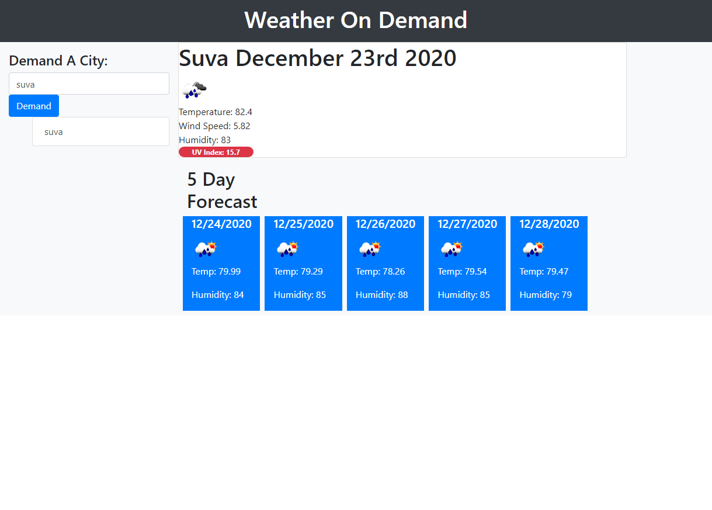

# Weather Dashboard
- A weather dashboard app that allows the user to search the weather and 5 day forecast in any city they want. The app also saves the users past searches for quick reference.

## User Story

```
AS A traveler
I WANT to see the weather outlook for multiple cities
SO THAT I can plan a trip accordingly
```

## Table of contents
- [General Info](#general-info)
- [Link to deployed page](#general-info)
- [Home Page](#home-page)
- [City Search ](city-search)
- [Technologies](#technologies)
- [Summary](#summary)
- [Author](#author)

## General Info

This weather dashboard meets the following criteria 

```
GIVEN a weather dashboard with form inputs
WHEN I search for a city
THEN I am presented with current and future conditions for that city and that city is added to the search history
WHEN I view current weather conditions for that city
THEN I am presented with the city name, the date, an icon representation of weather conditions, the temperature, the humidity, the wind speed, and the UV index
WHEN I view the UV index
THEN I am presented with a color that indicates whether the conditions are favorable, moderate, or severe
WHEN I view future weather conditions for that city
THEN I am presented with a 5-day forecast that displays the date, an icon representation of weather conditions, the temperature, and the humidity
WHEN I click on a city in the search history
THEN I am again presented with current and future conditions for that city
WHEN I open the weather dashboard
THEN I am presented with the last searched city forecast
```
## Link to deployed page

- https://joshrehanek.github.io/weather-dashboard/

## Home Page


## City Search



## Technologies

This project is created with:

- [HTML](https://html.com/)
- [CSS](https://www.w3.org/Style/CSS/Overview.en.html)
- [Javascript](https://javascript.com/)
- [jQuery](https://jquery.com/)
- [Open Weather API](https://openweathermap.org/api)

## Summary

- A weather dashboard app that allows the user to search the weather and 5 day forecast in any city they want. The app also saves the users past searches for quick reference.


## Author

- Joshua Azzam Rehanek
